# Руководство пользователя RetourenJournal

Это черновик пользовательской документации v1. Интерфейс приложения сейчас на немецком языке, поэтому названия кнопок и разделов в тексте приводятся так, как они отображаются в системе.

## 1. Быстрый старт

RetourenJournal помогает вести возвраты в одном месте: фиксировать данные клиента, заказ, товары, решение по возврату, доставку, возмещение и историю изменений.

Типовой процесс работы выглядит так:

1. Войти в систему.
2. Подтвердить email, если система просит это сделать.
3. Создать или выбрать организацию.
4. Открыть список возвратов.
5. Создать новый возврат или открыть существующий.
6. Проверить товар, принять решение и оформить дальнейшие действия: доставку, возмещение или закрытие возврата.

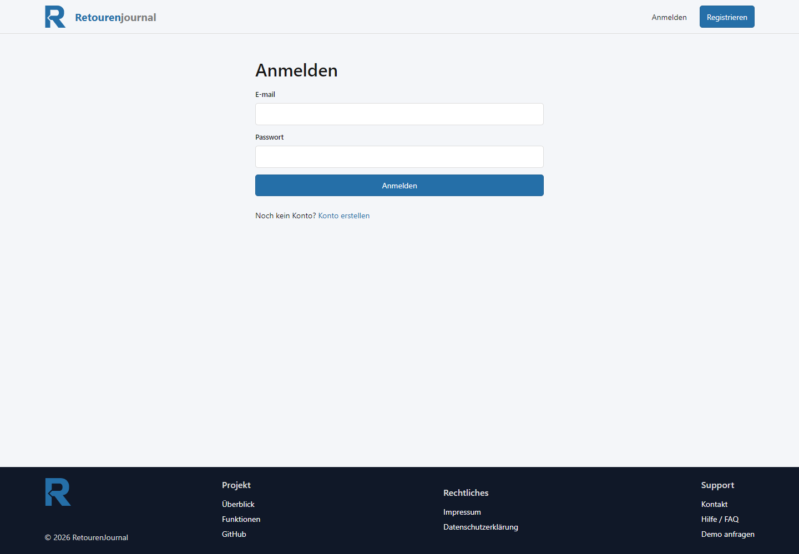

После входа пользователь попадает в рабочую область приложения. Если организация уже настроена, система предлагает перейти к списку возвратов.

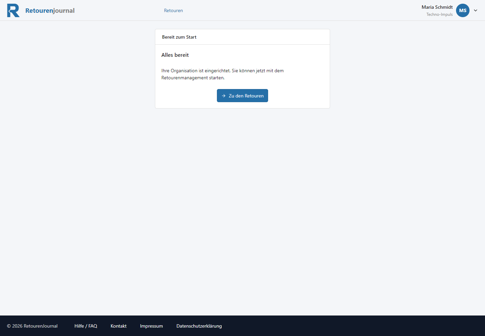

Если организация еще не создана, ее нужно создать перед началом работы с возвратами.

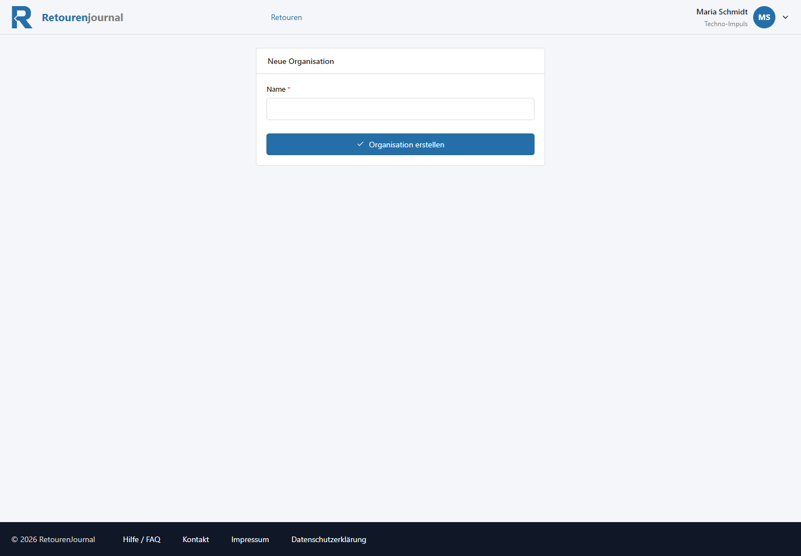

Основная рабочая точка приложения - список возвратов. Из него можно перейти к конкретной заявке или создать новую.

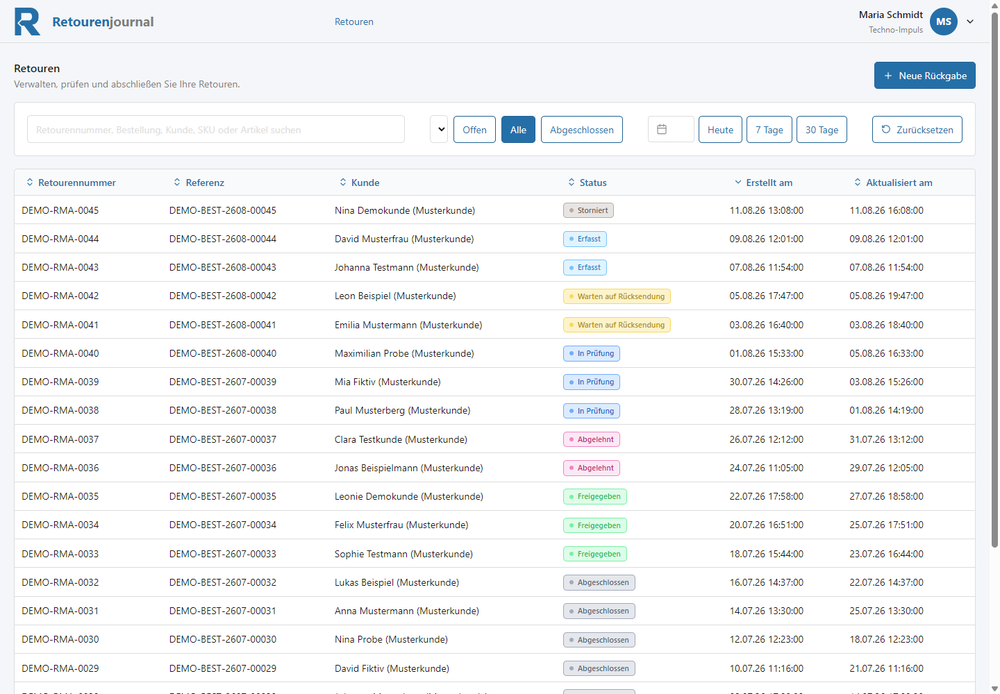

## 2. Основные понятия

**Организация** - рабочее пространство компании или команды. Все возвраты привязаны к организации.

**Пользователь** - человек, который работает в системе от имени организации.

**Клиент** - покупатель, по которому оформляется возврат. В возврате могут храниться имя, email, телефон и адрес клиента.

**Возврат** - основная запись в системе. В ней собраны данные заказа, клиента, товаров, решения, доставки, возмещения и истории.

**Позиция возврата** - отдельный товар внутри возврата. У позиции могут быть SKU, название, серийный номер, количество, цена и валюта.

**Статус возврата** - текущее состояние обработки. Например: создан, ожидает возврата товара, находится на проверке, одобрен, отклонен, завершен или отменен.

**Решение по возврату** - результат проверки: возврат может быть одобрен или отклонен. Решение помогает понять, какие дальнейшие действия нужны.

**Доставка и логистика** - информация о движении товара: направление, кто оплачивает доставку, статус, служба доставки и трекинг.

**Возмещение** - финансовая часть возврата: сумма, статус, дата создания и дата фактического возврата средств.

**История** - журнал событий по возврату. В нем фиксируются изменения статусов, создание доставки, создание возмещения и другие важные действия.

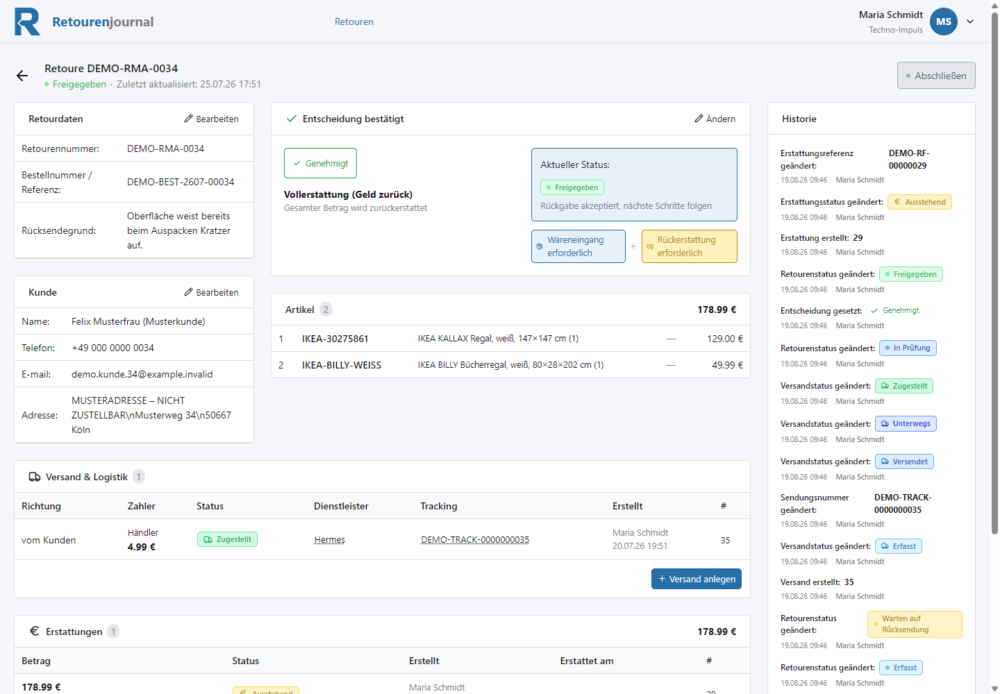

## 3. Аккаунт и организация

Для работы с системой нужно войти под своим email и паролем.

Если email еще не подтвержден, система показывает отдельный экран. Нужно открыть письмо с подтверждением и перейти по ссылке. Если письмо не пришло, можно отправить его повторно кнопкой `Bestätigungs-E-Mail erneut senden`.

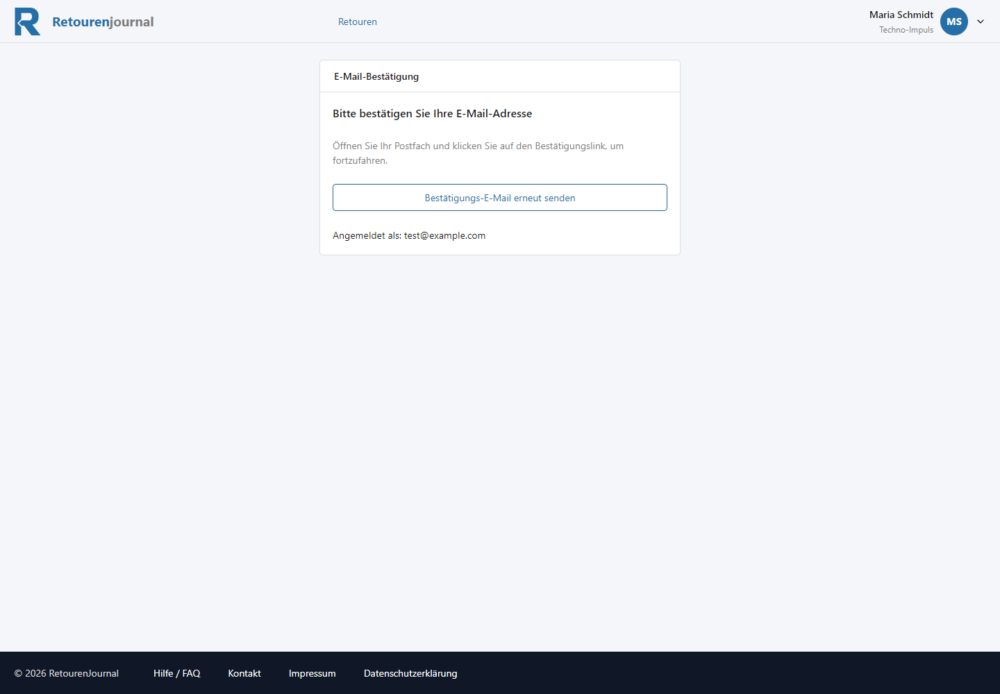

Организация нужна, чтобы отделить данные одной компании от другой. Пока организация не создана или не выбрана, работа с возвратами может быть ограничена.

В текущей версии документации предполагается один простой сценарий: пользователь работает внутри своей организации и ведет возвраты этой организации.

## 4. Возвраты

Возврат создается через кнопку `Neue Rückgabe` в списке возвратов.

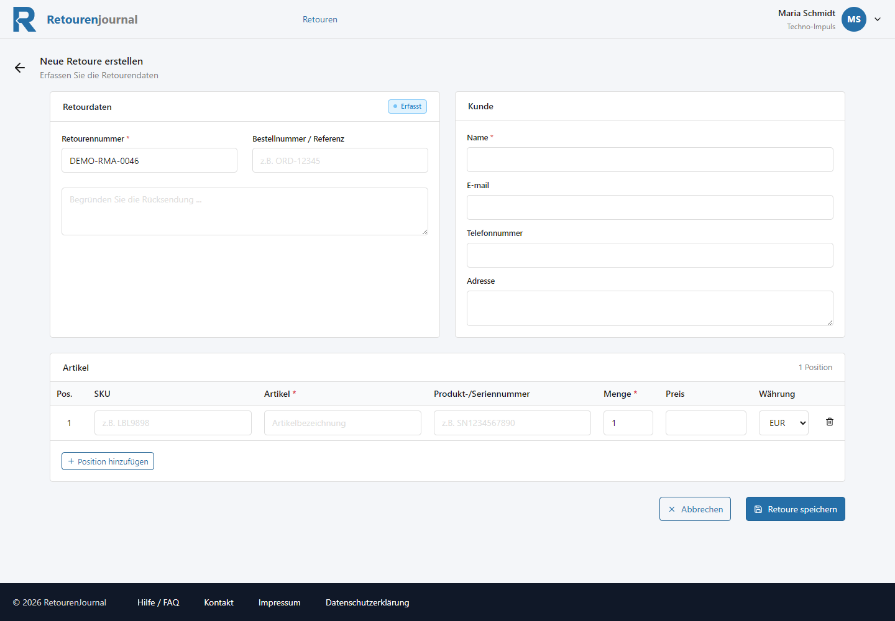

В форме создания возврата есть несколько основных блоков:

- `Retourdaten` - номер возврата, номер заказа или внешняя ссылка, причина возврата.
- `Kunde` - данные клиента.
- `Artikel` - товары, которые возвращаются.

В блоке клиента нужно указать минимум имя клиента. Email, телефон и адрес помогают быстрее связаться с клиентом и разобраться в спорных ситуациях.

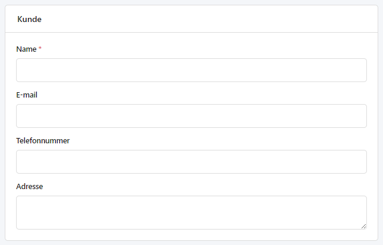

В блоке товаров указываются позиции возврата. Для каждой позиции можно заполнить SKU, название товара, серийный номер, количество, цену и валюту.

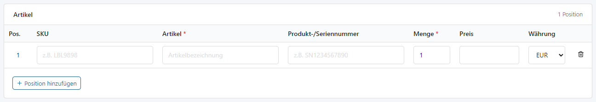

Если обязательные поля не заполнены, система покажет ошибки валидации. В таком случае нужно исправить отмеченные поля и повторить сохранение.

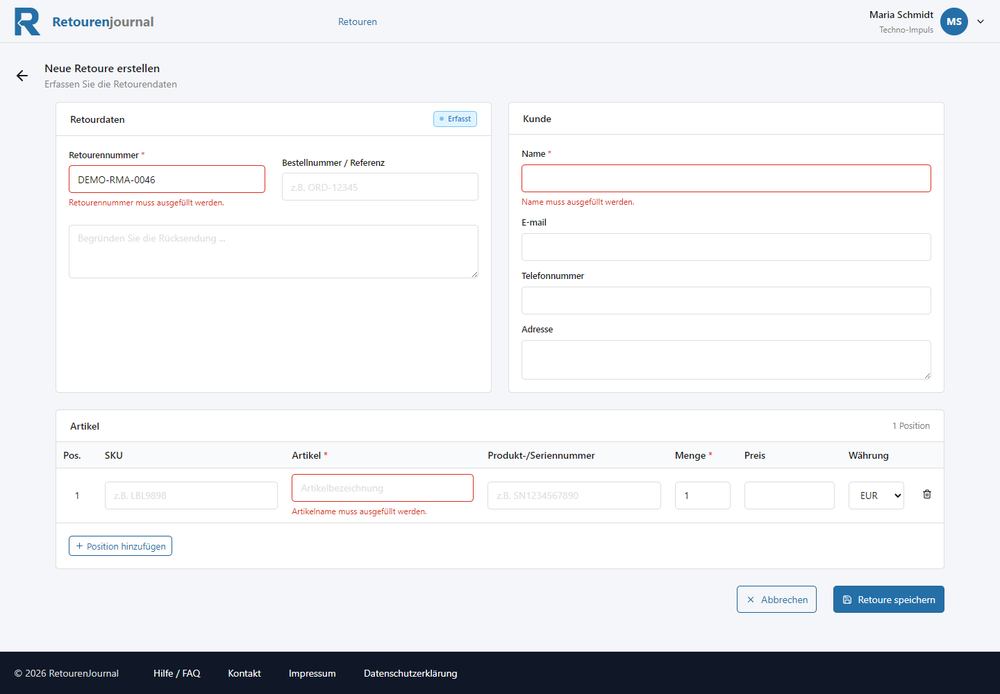

После создания возврата он открывается как карточка. В карточке видны данные возврата, клиент, товары, решение, доставка, возмещение и история.

## 5. Список возвратов

Список возвратов показывает все заявки, доступные текущей организации. В таблице отображаются номер возврата, ссылка на заказ, клиент, статус, дата создания и дата последнего обновления.

В верхней части списка есть поиск и фильтры. Поиск помогает найти возврат по номеру, заказу, клиенту, SKU или названию товара. Фильтры позволяют сузить список по статусу и периоду.

Если по текущему поиску или фильтрам ничего не найдено, система покажет пустое состояние. В этом случае можно изменить запрос или нажать `Filter zurücksetzen`.

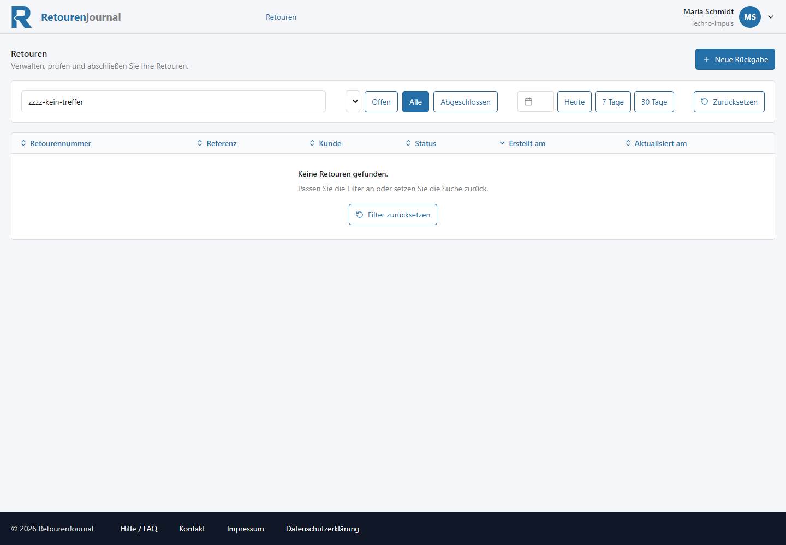

Если в организации пока нет возвратов, список также будет пустым. Это нормальное состояние для нового аккаунта или новой организации.

## 6. Статусы и обработка

Статус показывает, где возврат находится в процессе обработки. По статусам удобно быстро понимать, какие заявки требуют внимания.

Типовой жизненный цикл возврата:

1. Возврат создан.
2. Ожидается получение товара от клиента.
3. Товар находится на проверке.
4. По возврату принято решение.
5. При необходимости оформляется доставка или возмещение.
6. Возврат закрывается.

В списке статус отображается как цветная метка.

В карточке возврата видно решение и текущий статус. Например, возврат может быть одобрен, но при этом система еще показывает, что требуется поступление товара или возмещение.

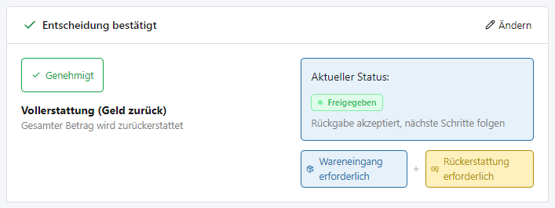

История помогает понять, кто и когда менял статус или создавал связанные записи.

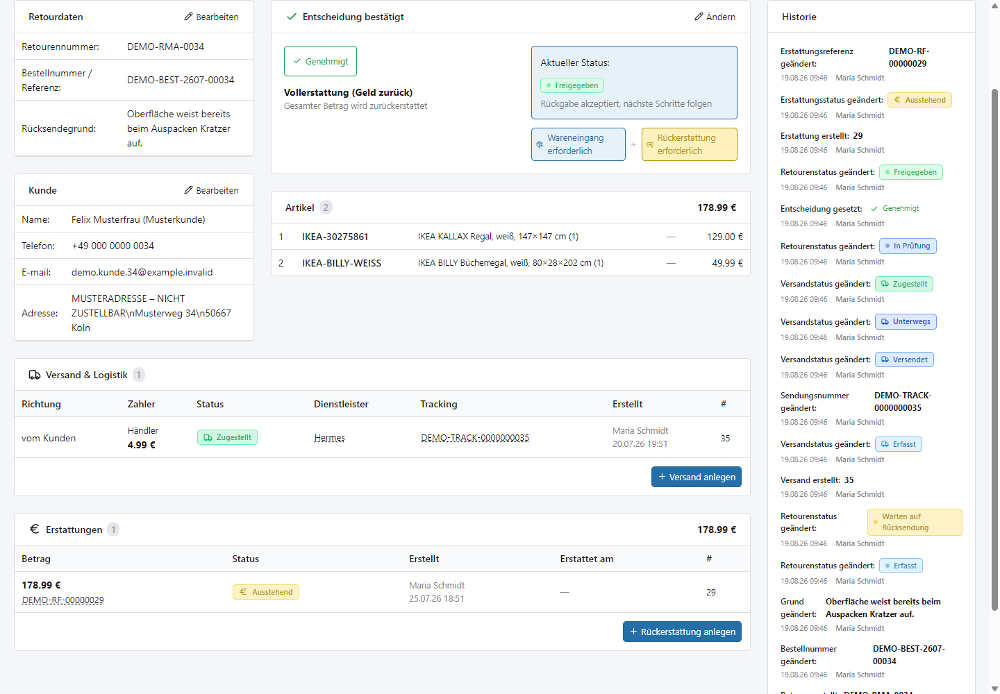

Доставка отображается в блоке Versand & Logistik. Здесь видно направление отправки, плательщика, статус доставки, службу доставки и трекинг-номер.

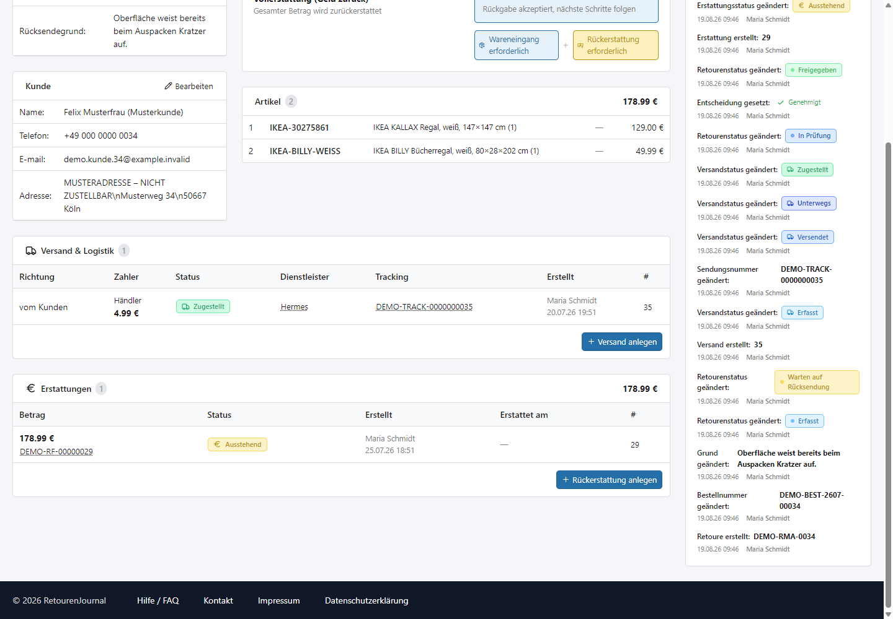

## 7. Возмещения

Возмещение фиксирует финансовую часть возврата. В блоке `Erstattungen` отображаются сумма, статус, кто создал запись, дата создания, дата фактического возмещения и внутренний номер.

Возмещение может быть ожидающим, выполненным или находиться в другом статусе, предусмотренном процессом. Если возврат одобрен, но деньги еще не возвращены, такой возврат не стоит считать финансово закрытым.

Кнопка `Rückerstattung anlegen` используется для создания новой записи возмещения, если она требуется по процессу.

## 8. Типовые сценарии

### Создать первую возвратную заявку

1. Откройте раздел `Retouren`.
2. Нажмите `Neue Rückgabe`.
3. Заполните данные возврата.
4. Заполните данные клиента.
5. Добавьте товары.
6. Нажмите `Retoure speichern`.

Используйте скриншоты:

- `06-create-return-form.png`
- `07-create-return-customer.png`
- `08-create-return-items.png`

### Найти возврат клиента

1. Откройте список возвратов.
2. Введите номер возврата, номер заказа, имя клиента или SKU в поле поиска.
3. При необходимости уточните статус или период.
4. Откройте нужную строку в таблице.

Используйте скриншоты:

- `09-returns-list-filled.png`
- `13-returns-filters.png`
- `14-returns-filtered-empty.png`

### Обработать полученный товар

1. Откройте карточку возврата.
2. Проверьте данные клиента и товаров.
3. Посмотрите текущий статус.
4. Зафиксируйте решение по возврату.
5. При необходимости добавьте доставку или возмещение.

Используйте скриншоты:

- `10-return-detail-overview.png`
- `11-return-status-processing.png`
- `17-shipment-section.png`
- `12-refund-section.png`

### Проверить историю возврата

1. Откройте карточку возврата.
2. Найдите блок `Historie`.
3. Проверьте последовательность событий и статусов.

Используйте скриншот:

- `16-return-history-notes.png`

## 9. Ошибки и проблемы

### Не получается продолжить из-за неподтвержденного email

Проверьте почтовый ящик и откройте письмо подтверждения. Если письма нет, нажмите `Bestätigungs-E-Mail erneut senden`.

### Возврат не находится

Сначала проверьте поисковую строку и активные фильтры. Если фильтры слишком узкие, список может быть пустым. Нажмите `Filter zurücksetzen` и повторите поиск.

### Форма не сохраняется

Проверьте обязательные поля. Обычно система подсвечивает поля, которые нужно заполнить или исправить.

### Список возвратов пустой

Если организация новая, в ней может еще не быть возвратов. Создайте первую заявку через `Neue Rückgabe`.

### Данные клиента указаны неверно

Откройте карточку возврата и используйте кнопку редактирования в блоке `Kunde`, если редактирование доступно для текущего состояния возврата.

## 10. FAQ

### Почему я не вижу возвраты?

Возможны две причины: в организации еще нет возвратов или активны фильтры, которые скрывают записи. Сначала сбросьте фильтры, затем создайте новый возврат, если список все еще пуст.

### Чем статус возврата отличается от статуса возмещения?

Статус возврата описывает обработку заявки в целом. Статус возмещения относится только к финансовой части: создано ли возмещение, ожидает ли оно выполнения или уже завершено.

### Можно ли создать возврат без всех данных клиента?

Минимальный набор зависит от обязательных полей формы. Лучше заполнять email, телефон и адрес, если эти данные доступны, потому что они помогают при дальнейшей обработке.

### Где посмотреть, что происходило с возвратом?

Откройте карточку возврата и посмотрите блок `Historie`. Там отображаются важные события и изменения статусов.

### Что делать, если товар уже получен, но возмещение еще не оформлено?

Откройте карточку возврата, проверьте решение и статус. Если возврат одобрен и требуется финансовое закрытие, создайте или обновите запись в блоке `Erstattungen`.

### Что делать, если клиент прислал товар без номера заказа?

Создайте возврат с доступными данными клиента и товара. В поле причины или примечаниях стоит указать, что номер заказа отсутствует, чтобы команда могла восстановить связь с заказом позже.
